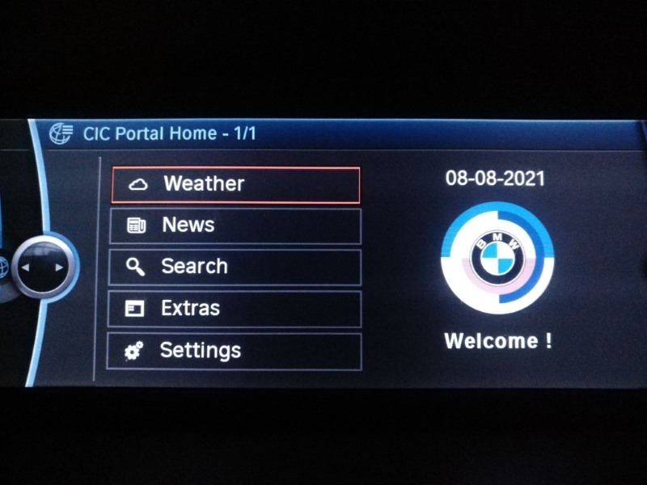

# What is this?


A home-brew implementation of BMW's Online portal for CIC High (8.8") infotainment units. It works through Bluetooth tethering.

If your telematics subscription is still active you can still access the original BMW servers. The public proxy that was accessible through Bluetooth tethering was shut down around 2018.

Modifications and pull requests highly encouraged!



## Scope

Only the Online / Live section is implemented. Internet requires binauth (I haven't figured out how to do this yet) and Squid bumping to account for the fact that almost no websites use SSL or TLS1.0

## Portal features

News - powered by 68knews (ActionRetro/68k-news)  
Weather - parsed from weather.com  
Search - powered by frogfind (ActionRetro/FrogFind)  
A somewhat crude lap timer  
A world clock  
Whatever else you wish to add :)


# Manual Installation


## Overview of the process

1. Set up a static IP web server. Either create it with the instructions provided or download the pre-made VM.

2. Set up the Squid proxy and host the portal pages from the server.

3. The Combox contains a set of XMLs that it falls back on if provisioning updates fail. This step can be skipped however, doing so could lead to the Combox defaulting to the BMW proxy IPs.

4. Code CIC and Combox.

5. Upload provisioning via Tool32 or 'Update Services' if Combox XMLs are modified.


## Server

You have a choice here. Self-hosted or cloud. It's typically quite difficult to obtain a static IP from a residential ISP. You don't want this IP to change especially if you modify the Combox XML(s).

For self-hosted I'd recommend a Debian VM.
For cloud, a small Lightsail instance is $3.50/month.

You will need an http web-server (Apache, Lighttpd, NGINX, etc.) and PHP.


The instructions below apply for a Debian 11 instance with Lighttpd and PHP8.2.

Add source:

`echo "deb https://packages.sury.org/php/ $(lsb_release -sc) main" | sudo tee /etc/apt/sources.list.d/sury-php.list && curl -fsSL  https://packages.sury.org/php/apt.gpg | sudo gpg --dearmor -o /etc/apt/trusted.gpg.d/sury-keyring.gpg`


Install packages:  
`sudo su -c 'apt update && apt upgrade -y && apt install lighttpd lighttpd-mod-deflate php-fpm php-xml php-curl php-gd php-mbstring -y'`


Configure server:  
`ln -s /var/www/html/ web-root && sudo su -c 'chown admin:admin /var/www/ -R && echo -e "cgi.fix_pathinfo=1\nzlib.output_compression = On\nzlib.output_compression_level = 9\n" >> /etc/php/8.2/fpm/php.ini && ln -s /etc/lighttpd/conf-available/10-fastcgi.conf /etc/lighttpd/conf-enabled/ && ln -s /etc/lighttpd/conf-available/15-fastcgi-php.conf /etc/lighttpd/conf-enabled/ && ln -s /etc/lighttpd/conf-available/10-accesslog.conf /etc/lighttpd/conf-enabled/' `


Modify configuration:  
`sudo vi /etc/lighttpd/conf-available/15-fastcgi-php.conf`

```
fastcgi.server += ( ".php" => 
	((
		"socket" => "/run/php/php8.2-fpm.sock",
		"broken-scriptfilename" => "enable"
	))
)
```

Main lighttpd configuration:  
`sudo vi /etc/lighttpd/lighttpd.conf`


```
server.modules = (
  "mod_expire",
  "mod_setenv",
  "mod_indexfile",
  "mod_access",
  "mod_alias",
  "mod_redirect",
  "mod_deflate",
  "mod_dirlisting",
  "mod_staticfile",
)

expire.url = ( "/assets/" => "access plus 1 months" )


server.document-root        = "/var/www/html"
server.upload-dirs          = ( "/var/cache/lighttpd/uploads" )
server.errorlog             = "/var/log/lighttpd/error.log"
server.pid-file             = "/var/run/lighttpd.pid"
server.username             = "www-data"
server.groupname            = "www-data"
server.port                 = 80
server.tag = 		    ""

# strict parsing and normalization of URL for consistency and security
# https://redmine.lighttpd.net/projects/lighttpd/wiki/Server_http-parseoptsDetails
# (might need to explicitly set "url-path-2f-decode" = "disable"
#  if a specific application is encoding URLs inside url-path)
server.http-parseopts = (
  "header-strict"           => "enable",# default
  "host-strict"             => "enable",# default
  "host-normalize"          => "enable",# default
  "url-normalize-unreserved"=> "enable",# recommended highly
  "url-normalize-required"  => "enable",# recommended
  "url-ctrls-reject"        => "enable",# recommended
  "url-path-2f-decode"      => "enable",# recommended highly (unless breaks app)
  "url-path-dotseg-remove"  => "enable",# recommended highly (unless breaks app)
)

index-file.names            = ( "index.php", "index.html" )
url.access-deny             = ( "~", ".inc" )
static-file.exclude-extensions = ( ".php", ".pl", ".fcgi" )

deflate.cache-dir           = "/var/cache/lighttpd/compress/"
deflate.mimetypes           = ( "application/javascript", "text/css", "text/html", "text/plain", "font/ttf", "application/xml" )
deflate.allowed-encodings   = ( "gzip", "deflate" )

# default listening port for IPv6 falls back to the IPv4 port
include_shell "/usr/share/lighttpd/use-ipv6.pl " + server.port
include_shell "/usr/share/lighttpd/create-mime.conf.pl"
include "/etc/lighttpd/conf-enabled/*.conf"

```


Re-start the web server:  
`sudo systemctl restart lighttpd.service; sudo systemctl restart php*`


Copy the portal files to the web root (/var/www/html/) and change permissions for settings files, cache folder for frogfind,news:  

`sudo su -c 'chown www-data:www-data /var/www/html/settings/vehicle -R; chown www-data:www-data /var/www/html/search/php/library/cache -R; chown www-data:www-data /var/www/html/news/php/library/cache -R; chown www-data:www-data /var/www/html/weather/cache'`


## Squid


All requests from the CIC are proxied before they reach a server. We will set up a http proxy with basic auth. An added benefit of the proxy is that you don't need to keep port 80 open to the world.


`sudo apt install squid apache2-utils -y`  
`sudo su -c 'touch /etc/squid/passwords && chmod 777 /etc/squid/passwords && htpasswd -c /etc/squid/passwords b2v_standard'`  
`sudo su -c 'mv /etc/squid/squid.conf /etc/squid/squid.conf.original && vi /etc/squid/squid.conf'`  


```
auth_param basic program /usr/lib/squid/basic_ncsa_auth /etc/squid/passwords
auth_param basic realm Squid
auth_param basic credentialsttl 24 hours
acl authenticated proxy_auth REQUIRED
acl Safe_ports port 80
http_access deny !to_localhost
http_access deny !Safe_ports
http_access allow authenticated
http_access deny all
reply_header_access X-Cache-Lookup deny all
reply_header_access X-Cache deny all
dns_v4_first on
forwarded_for delete
via off
http_port 8080
cache deny all

logformat timereadable %tl %6tr %>a %Ss/%03Hs %<st %rm %ru %un %Sh/%<A %mt
access_log daemon:/var/log/squid/access.log timereadable
```


Restart squid:  
`sudo systemctl restart squid`


If ufw is installed:  
`sudo ufw allow 8080/tcp && `


## Combox


The Combox uses essentially the same hardware as the CIC sans the Fujitsu Carmine GPU and half the RAM. If you read the HARMAN manual you will note that pins 8 (TX), 9 (RX) and 16 (GND) are UART to the SH4 chip.

Hook up a simple UART (57600) adapter to those pins and you will see debug output that is printed by a custom binary (TestMenu). However, in order to do anything fun like say, execute commands we will need to login to this binary with root access. 


1. Press l - login to level 1 (default access) with password "COMBOX__01HB".​

2. Press 2 - log menu -> write to usb (usb drive plugged in to armrest).​  
   This creates a folder "Log\_\*day\*\_\*month\*\_\*year\*\_\_\*hour\*\_\*minutes\*\_\*seconds\*​  
   Get Protect.DAT from subdirectory "HBHK" and rename it to "t.DAT".

3. FTP into CIC and upload comboxconsole, rootpersists.DAT and t.DAT to /mnt/hbuser.

4. SSH into CIC and run:

`cd /mnt/hbuser && chmod +x comboxconsole && ./comboxconsole`

5. l - login, 6 - Show Passwords


Modify the XML provided (dpas_003.xml) to include your proxy IP. Place your modified XMLs to the root of a usb drive in a folder named "xml", log in as root on the Combox and exit to shell (0). Run:  

`mount -o remount rw /HBProvisioning && cp /fs/usb0/xml/* /HBProvisioning/xml/ && mount -o remount ro /HBProvisioning && rm -r /HBProvisioningDyn/* && slay BMW_MAIN`


## Coding

Code CIC and Combox with #0911 and $6AL.
I recommend the following parameters to improve integration and ensure the correct fallback xml is loaded:

### Combox

```
DPAS_INDEX
	dpas_3
CONFIG_INDEX
	config_index_3
SIM_ENABLED_MB
	csim
```


### CIC

```
DPAS_INDEX
	dpas_3
CONFIG_INDEX
	config_index_3
CONTACT_NUM_HOTLINE_0B				
	nicht_aktiv						
CONTACT_NUMBERS_DEALER
	nicht_aktiv
CONTACT_NUMBERS_BCALL_0B
	nicht_aktiv
ONLINE_BROWSER_C0D
	nur_bmw_online_aktiv
ONLINE_BROWSER_LIVE
	nicht_aktiv
```


## Provisioning

The provisioning file contains markup that describes what Online services are available, where they can be reached and how they should be configured.
Replace \*your IP\* with the IP address of the proxy.

To load manually with Tool32:

1. Copy provisioning.xml (from folder 'Server root') to the root of the C: drive.

2. Start Tool32 and load CMEDIAR.PRG.

3. Select job schreiben_ota, set argument C:\provision.xml and execute.


**HIBackEnd_1.xml is an example Harman provisioning file included in the combox. This should give you an idea of what other features are available should you wish to implement them.


## Security

Some provisions were made to allow multiple cars to use a single server. However, access control and strict VIN validation are required for a 'production' solution.
If you're going to deploy, additional checks need to be added.


## Notes/gotchas

* Set Date/Time before provisioning.
* If provisioning works successfully via tethering but BMW Online/Live does not (gets stuck on 'Starting'):
  **Try disabling Audio first**. I find on most devices having both 'Audio' and 'Data Transfer' enabled tends to create loops.
  Reset everything. Run Tool32 job STEUERN_RESET_TO_BASIC_STATE with argument 0x00000000, STEUERGERAETE_RESET on CMEDIAR. Then STEUERGERAETE_RESET the CICR and re-pair the phone. Might take a couple of tries.
* The proxy defined in the provisioning XML must be an IPv4 instead of a domain name. Domain names cannot be resolved at this stage.
* The server address can be defined as both a domain name or IPv4. Setting to an IP should save on a DNS query.
* Setting addresses such as BON and provisioning to 127.0.0.1 speeds up access since Squid won't have to make a DNS query.
* Static assets such as PNGs are cached for the current session. Set cache headers to persist cache.
* Gzip compression is supported.
* The Ghidra module for SH4 is quite good.


Browser engine specs [NetFront 3.4]:

- HTML4.01, XHTML1.1, cHTML, XHTML Basic 1.0, WML1.3
- CSS 1 & 2
- ECMAScript 3rd Edition (JavaScript 1.5)
- DOM1, 2 and Dynamic HTML
- GIF, animated GIF, BMP, PNG, JPEG and MNG
- HTTP1.1
- SSL2.0/3.0,TLS1.0
- Cookies


Testing with a computer:

- Use firefox
- Adjust the proxy IP from Network Settings -> Manual Proxy Configuration
- Go to about:config and set network.proxy.allow_hijacking_localhost to true
- Visit http://127.0.0.1/bonstartpage.php?development and refresh the page
OR
- Open port 80 and connect directly to the webserver bypassing Squid (should be restricted to your IP)


Monitoring traffic:

- External to Squid:  `sudo tcpdump -i eth0 -s 65535 -w squid.pcap port 8080 --print`
- Internal to server: `sudo tcpdump -i lo -s 65535 -w http.pcap port 80 --print`


Phones tested:

- iPhone 4S (iOS 5.0.1) - working
- Galaxy A5 2017 (8.0.0) - working
- LEX720 (Lineage 18.1) - working


Provisioning XML parameters:

```
<bon>
<csdtimeout>0</csdtimeout>
<gprstimeout>120</gprstimeout>
</bon>
```

- bon - BWM ONLINE
- csdtimeout - Circuit Switched Data - precursor to GPRS. N/A, set to 0.
- gprstimeout - time in seconds after a GPRS connection is finished that it will stay awake for the next request. Higher values improve experience but drain phone battery.
- PSIM (Prefit SIM), CSIM (Customer SIM)